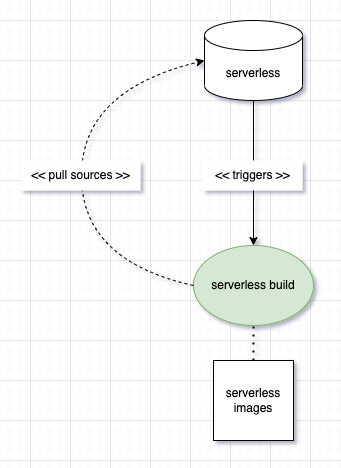

# Proposal of code separation in modularization

## serverless-test job

Job is triggered by changes in serverless repository filtered by given regexp.
This job is not dependent on other jobs.

## serverless-build job 

Job is triggered by changes in serverless repository filtered by given regexp.
This job is not dependent on other jobs.

The purpouse of this job is to build the docker image of the `function-controller` (e.g. Kaniko in PROW)

## serverless-module-build

## serverless-module-test job

Job can be triggered by changes in serverless repository filtered by given regexp.
This job is not dependent on other jobs.

### details

1. The sources of `serverless` repo are checked out:
- In the first phase the sources and the charts of `function-cotroller` will be in the `kyma` repository. 
- The checkout can be shallow to improve performance.

2. The `serverless-manager` sources are checked out.

3. The `serverless-controller` chart is generated.
- In the first phase the charts will be copied from `resources` directory in `kyma-repository`.
- The `function-controller`'s image tag does not matter.

4. The `serverless` Helm chart is copied.

4. The `serverless-manager` unit tests are executed.

