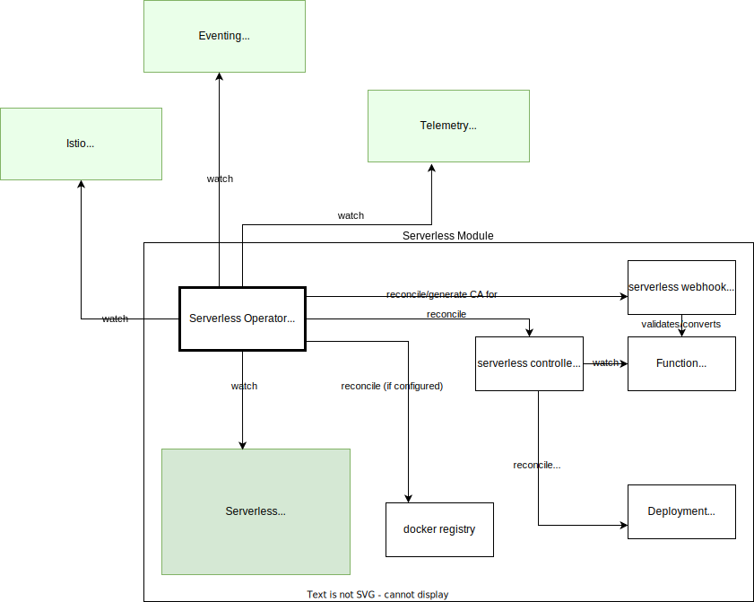

# Overview

Following the motivation of [kyma modularisation](https://github.com/kyma-project/community/tree/main/concepts/modularization), serverless should become a module that can be enabled/disabled by the user. 
Serverless should have its own operator (`serverless-manager`) that should be installed in the target kyma runtime by an infrastructure operators based on the module descriptor (a.k.a `Module Template`).
`Serverless-manager` watches `Serverless` Custom Resource to re-configure (reconcile) serverless instalation.

## Serverless CR

Reconciliation of serverless components is driven by the content of the `Serverless` Custom Resource.

Serverless CR is a configuration for serverless.

It provides API for configuration capabilities:
 - user can override tracing backend ( by default jaeger is used if it is discovered )
 - user can override metrics backend ( by default prometheus is used if it is discovered )
 - user can enable/disable internal docker registry
 - user can configure external docker registry configuration
 - user can override default gateway that exposes internal docker registry url for k8s
 - user can override default [build-time container resources](https://kyma-project.io/docs/kyma/latest/05-technical-reference/svls-09-available-presets/)
 - user can override default [function runtime container resources](https://kyma-project.io/docs/kyma/latest/05-technical-reference/svls-09-available-presets/)
 - user can configure max simultaneous build jobs
 - user can set maximum body size accepted by functions
 - user can modify log level of the serverless components (i.e controller, webhook)
 - ...

 Serverless CR shows the status of serverless module, i.e:
 - health of serverless workloads (i.e controller, webhook, docker registry installed)
 - url of the detected event publisher proxy
 - url of the detected/configured otlp endpoints
 - indication whether internal docker registry is used / url of configured docker registry

```yaml
apiVersion: operator.kyma-project.io/v1alpha1
kind: Serverless
  name: serverless-sample
spec:
  dockerRegistry:
    enableInternal: true
    externalDockerRegistrySecretName: xxxx
    gateway: kyma-system/kyma-gateway #dependency to gateway that should expose docker registry for the k8s to schedule function pods
  eventingPublisherProxy: http://eventing-publisher-proxy.kyma-system.svc.cluster.local/publish
  otlpTracesEndpoint: http://tracing-jaeger-collector.kyma-system.svc.cluster.local:2342/v1/metrics ##<-- this is a dummy example
  otlpMetricsEndpoint: http://tracing-jaeger-collector.kyma-system.svc.cluster.local:4318/v1/trace
  defaultFunctionRuntimePreset: M
  defaultFunctionBuildPreset: S
  maxParallelFunctionBuilds: 5
  controllerLogLevel: debug
  webhookLogLevel: debug
  ## runtime config
  maxRequestPayloadSize: 2MB
  functionTimeoutSeconds: 180
status:
 # health of serverless workloads (i.e controller, webhook, docker registry installed)
 # url of the detected event publisher proxy
 # url of the detected/configured otlp endpoints
 # indication whether internal docker registry is used / url of configured docker registry
```

## Dependencies

There are other kyma modules that are watched by serverless manager:
 - Istio (a hard dependency in case internal docker registry is configured)
 - Eventing (soft dependency)
 - Telemetry (soft dependency)

The eventing and telementry modules are not required for serverless to install. If they are discovered they deliver default values for serverless configuration (i.e publisherProxyEndpoint, otlpEnpoints).
The detected and used endpoints should be part of the Serverless CR status.

If the internal docker registry is configured serverless exposes it via Istio virtual service. In such case we have to treat istio as hard requirement and fail installation if istio is not discovered.
If internal docker registry is disabled, serverless doesnt need istio CRs and therefore should not require Istio to install.



>NOTE: Until the dependant modules are discoverable in the modular fashion the serverless manager can test the availibility of the endpoints directly

## Propagating configuration to the Function runtime

When a dependant module is discovered OR when a user overrides the Serverless CR manually the serverless manager should reconcile the serverless controller.
If the change affect the function runtime (i.e otlpEndpoint), the serverless controller should automatically change the ENVs in the pod templates of the function deployments. This should restart functions and new ENV values should be consumed.