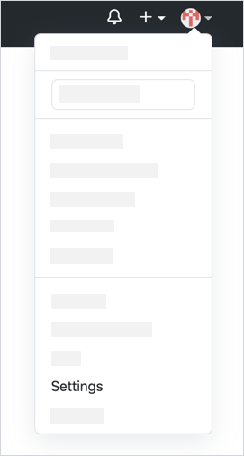
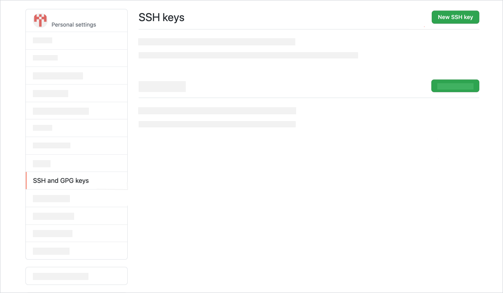
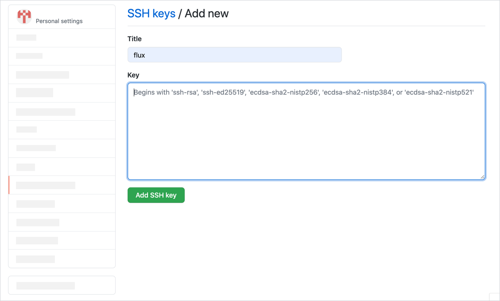

# Synchronize Git resources with the cluster using a GitOps operator

This tutorial shows how you can automate the deployment of local Kyma resources on a cluster using the GitOps logic. You will use [Kyma CLI](https://github.com/kyma-project/cli) to create an inline Python Function. You will later push the resource to a GitHub repository of your choice and set up a GitOps operator to monitor the given repository folder and synchronize any changes in it with your cluster. For the purpose of this tutorial, you will install and use the [Flux](https://fluxcd.io/flux/get-started/) GitOps operator and a lightweight [k3d](https://k3d.io/) cluster.

>**TIP:** Although this tutorial uses Flux to synchronize Git resources with the cluster, you can use an alternative GitOps operator for this purpose, such as [Argo](https://argoproj.github.io/argo-cd/).

## Prerequisites

All you need before you start is to have the following:

- [Docker](https://www.docker.com/)
- Git repository
- [Homebrew](https://docs.brew.sh/Installation)
- Kyma CLI
- Kubeconfig file to your Kyma cluster

## Steps

These sections will lead you through the whole installation, configuration, and synchronization process. You will first install k3d and create a cluster for your custom resources (CRs). Then, you will need to apply the necessary CustomResourceDefinition (CRD) from Kyma to be able to create Functions. Finally, you will install Flux and authorize it with the `write` access to your GitHub repository in which you store the resource files. Flux will automatically synchronize any new changes pushed to your repository with your k3d cluster.

### Install and configure a k3d cluster

1. Install k3d using Homebrew on macOS:

  ```bash
  brew install k3d
  ```

2. Create a default k3d cluster with a single server node:

  ```bash
  k3d cluster create {CLUSTER_NAME}
  ```

  This command also sets your context to the newly created cluster. Run this command to display the cluster information:

  ```bash
  kubectl cluster-info
  ```

3. Apply the `functions.serverless.kyma-project.io` CRD from sources in the [`kyma`](https://github.com/kyma-project/kyma/tree/main/installation/resources/crds/serverless) repository. You will need it to create the Function CR on the cluster.

  ```bash
  kubectl apply -f https://raw.githubusercontent.com/kyma-project/kyma/main/installation/resources/crds/serverless/functions.serverless.crd.yaml
  ```
4. Run this command to make sure the CRs are applied:

  ```bash
  kubectl get customresourcedefinitions
  ```

### Prepare your local workspace

1. Create a workspace folder in which you will create source files for your Function:

  ```bash
  mkdir {WORKSPACE_FOLDER}
  ```

2. Use the `init` Kyma CLI command to create a local workspace with default configuration for a Python Function:

  ```bash
  kyma init function --runtime python39 --dir $PWD/{WORKSPACE_FOLDER}
  ```

  >**TIP:** Python 3.9 is only one of the available runtimes. Read about all [supported runtimes and sample Functions to run on them](07-10-sample-functions.md).

  This command will download the following files to your workspace folder:

  - `config.yaml`	with the Function's configuration
  - `handler.py` with the Function's code and the simple "Hello World" logic
  - `requirements.txt` with an empty file for your Function's custom dependencies

### Install and configure Flux

You can now install the Flux operator, connect it with a specific Git repository folder, and authorize Flux to automatically pull changes from this repository folder and apply them on your cluster.

1. Install Flux:

  ```bash
  brew install fluxctl
  ```

2. Create a `flux` Namespace for the Flux operator's CRDs:

  ```bash
  kubectl create namespace flux
  kubectl label namespace flux istio-injection=enabled --overwrite
  ```

3. Export details of your GitHub repository - its name, the account name, and related e-mail address. You must also specify the name of the folder in your GitHub repository to which you will push the Function CR built from local sources. If you don't have this folder in your repository yet, you will create it in further steps. Flux will synchronize the cluster with the content of this folder on the `main` branch.

  ```bash
  export GH_USER="{USERNAME}"
  export GH_REPO="{REPOSITORY_NAME}"
  export GH_EMAIL="{EMAIL_OF_YOUR_GH_ACCOUNT}"
  export GH_FOLDER="{GIT_REPO_FOLDER_FOR_FUNCTION_RESOURCES}"
  ```

4. Run this command to apply CRDs of the Flux operator to the `flux` Namespace on your cluster:

  ```bash
  fluxctl install \
  --git-user=${GH_USER} \
  --git-email=${GH_EMAIL} \
  --git-url=git@github.com:${GH_USER}/${GH_REPO}.git \
  --git-path=${GH_FOLDER} \
  --namespace=flux | kubectl apply -f -
  ```

  You will see that Flux created these CRDs:

  ```bash
  serviceaccount/flux created
  clusterrole.rbac.authorization.k8s.io/flux created
  clusterrolebinding.rbac.authorization.k8s.io/flux created
  deployment.apps/flux created
  secret/flux-git-deploy created
  deployment.apps/memcached created
  service/memcached created
  ```

5. List all Pods in the `flux` Namespace to make sure that the one for Flux is in the `Running` state:

  ```bash
  kubectl get pods --namespace flux
  ```

  Expect a response similar to this one:

  ```bash
  NAME                        READY   STATUS    RESTARTS   AGE
  flux-75758595b9-m4885       1/1     Running   0          32m
  ```

6. Obtain the certificate (SSH key) that Flux generated:

  ```bash
  fluxctl identity --k8s-fwd-ns flux
  ```

7. Run this command to copy the SSH key to the clipboard:

  ```bash
  fluxctl identity --k8s-fwd-ns flux | pbcopy
  ```

8. Go to **Settings** in your GitHub account:

  

1. Go to the **SSH and GPG keys** section and select the **New SSH key** button:

  

10. Provide the new key name, paste the previously copied SSH key, and confirm changes by selecting the **Add SSH Key** button:

  

### Create a Function

Now that Flux is authenticated to pull changes from your Git repository, you can start creating CRs from your local workspace files.

In this section, you will create a sample inline Function.

1. Back in the terminal, clone this GitHub repository to your current workspace location:

  ```bash
  git clone https://github.com/${GH_USER}/${GH_REPO}.git
  ```
  >**NOTE:** You can also clone the repository using SSH. To do that, you need to [generate a new SSH key and add it to the ssh-agent](https://docs.github.com/en/authentication/connecting-to-github-with-ssh/generating-a-new-ssh-key-and-adding-it-to-the-ssh-agent).

2. Go to the repository folder:

  ```bash
  cd ${GH_REPO}
  ```

3. If the folder you specified during the Flux configuration does not exist yet in the Git repository, create it:

  ```bash
  mkdir ${GH_FOLDER}
  ```

4. Run the `apply` Kyma CLI command to create a Function CR in the YAML format in your remote GitHub repository. This command will generate the output in the `my-function.yaml` file.

  ```bash
  kyma apply function --filename {FULL_PATH_TO_LOCAL_WORKSPACE_FOLDER}/config.yaml --output yaml --dry-run > ./${GH_FOLDER}/my-function.yaml
  ```

5. Push the local changes to the remote repository:

  ```bash
  git add .                        # Stage changes for the commit
  git commit -m 'Add my-function'  # Add a commit message
  git push origin main             # Push changes to the "main" branch of your Git repository. If you have a repository with the "main" branch, use this command instead: git push origin main
  ```

6. Go to the GitHub repository to check that the changes were pushed.

7. By default, Flux pulls CRs from the Git repository and pushes them to the cluster in 5-minute intervals. To enforce immediate synchronization, run this command from the terminal:

  ```bash
  fluxctl sync --k8s-fwd-ns flux
  ```

8. Make sure that the Function CR was applied by Flux to the cluster:

  ```bash
  kubectl get functions
  ```
You can see that Flux synchronized the resource and the new Function CR was added to your cluster.

## Reverting feature

Once you set it up, Flux will keep monitoring the given Git repository folder for any changes. If you modify the existing resources directly on the cluster, Flux will automatically revert these changes and update the given resource back to its version on the `main` branch of the Git repository.  