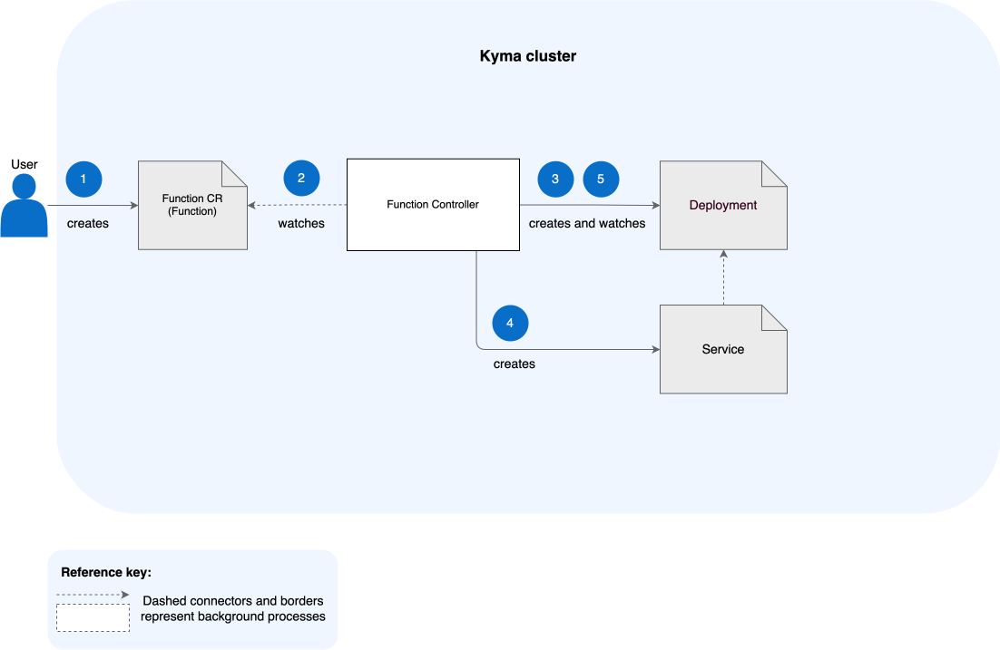

# Serverless Architecture

Serverless relies heavily on Kubernetes resources. It uses [Deployments](https://kubernetes.io/docs/concepts/workloads/controllers/deployment/) and [Services](https://kubernetes.io/docs/concepts/services-networking/service/) to deploy and manage Functions. See how these and other resources process a Function within a Kyma cluster:

> [!WARNING]
> Serverless imposes some requirements on the setup of namespaces. For example, if you apply custom [LimitRanges](https://kubernetes.io/docs/concepts/policy/limit-range/) for a new namespace, they must be higher than or equal to the limits for building Jobs' resources.

1. Create a Function either through the UI or by applying a Function custom resource (CR). This CR contains the Function definition (business logic that you want to execute) and information on the environment on which it should run.

2. The Function CR is processed by the Function Controller (FC), which validates and updates the resource.

3. FC creates a Deployment to manage the Function's Pods.

4. FC creates a Service to expose the Function.

5. FC waits for the Deployment to become ready.
